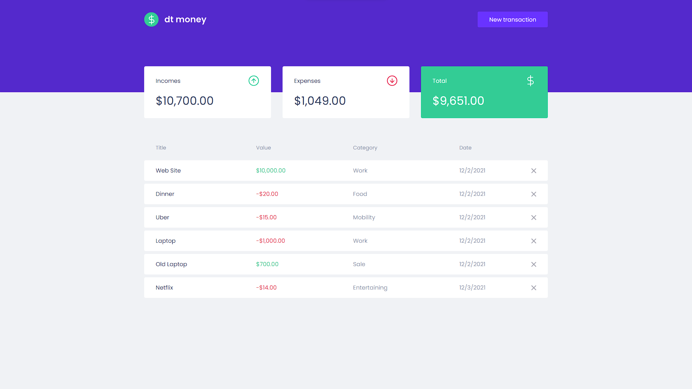

# DT MONEY

Here, I worked using ReactJs with TypeScript to create a transaction maganer app simulation, and for styles, I chose to use Styled Components. I was also able to use some libraries like Formik, yup and react-modal for the form development.

Access the project demo [here](https://dt-money-two.vercel.app/).

_This project was developed based on [Rocketseat](https://www.frontendmentor.io/challenges/todo-app-Su1_KokOW)'s design. By [Tiago Luchtenberg](https://www.instagram.com/tiagoluchtenberg/)._



## Main technologies that I used

- [ReactJS](https://reactjs.org/)
- [TypeScript](https://www.typescriptlang.org/)
- [Styled Components](https://styled-components.com/)
- [Formik](https://formik.org/docs/overview)
- [react-modal](https://github.com/reactjs/react-modal)

## How to run in your machine

### 1. Clone this repository

```zsh
git clone git@github.com:ericksilvadev/dt-money.git dt-money
```

### 2. Go to the repository you just created

```zsh
cd dt-money
```

### 3. Install the dependencies

yarn:

```zsh
yarn
```

npm:

```zsh
npm install
```

### 4. Open the app

yarn:

```zsh
yarn dev
```

npm:

```zsh
npm run dev
```
